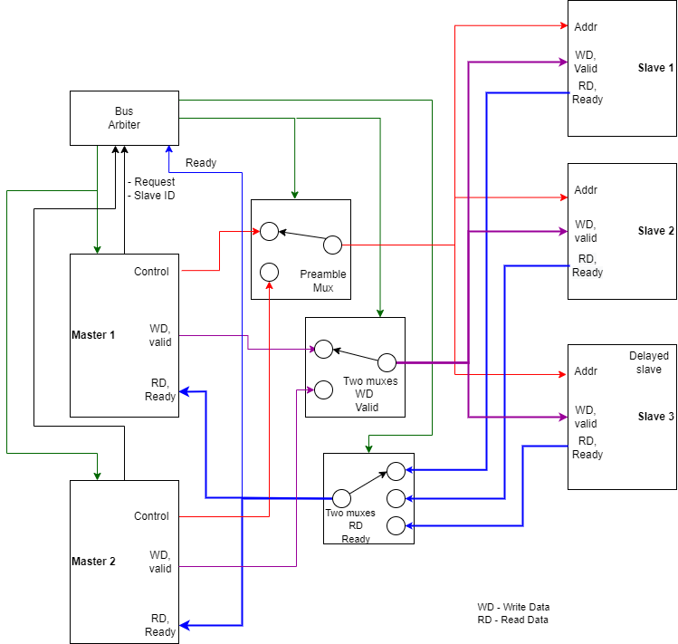

# SERIAL_BUS_project

_Design and implementation of a serial bus with multiple masters and slaves, arbiter and
top-level design that can carry out a specific set of tasks, including data transfer, prioritybased and split arbiter transaction & top-level verification._

## Design Architecture

---
## About 
 This repository include the design and the source files of custom serial bus protocol. This protocol uses a centralized bus arbiter to support both internal and external communication.

---
## Specifications

To see the specifications of design refer to [Specifications.md](Specifications.md)

---

## Main modules

To see the modules of design refer to [modules.md](modules.md)

---
## How to use this repo

To know how to use this repo to setup the protocol refer to [hows.md](hows.md)

---

### Source files - [src files](src/)
### Testbench files - [testbench files](testbenches/)

## Report
<iframe src="https://drive.google.com/file/d/1eFWtKxUWkx_KeGuPHDO2lDRdNPYl1dxH/preview" width="640" height="480" allow="autoplay"></iframe>

