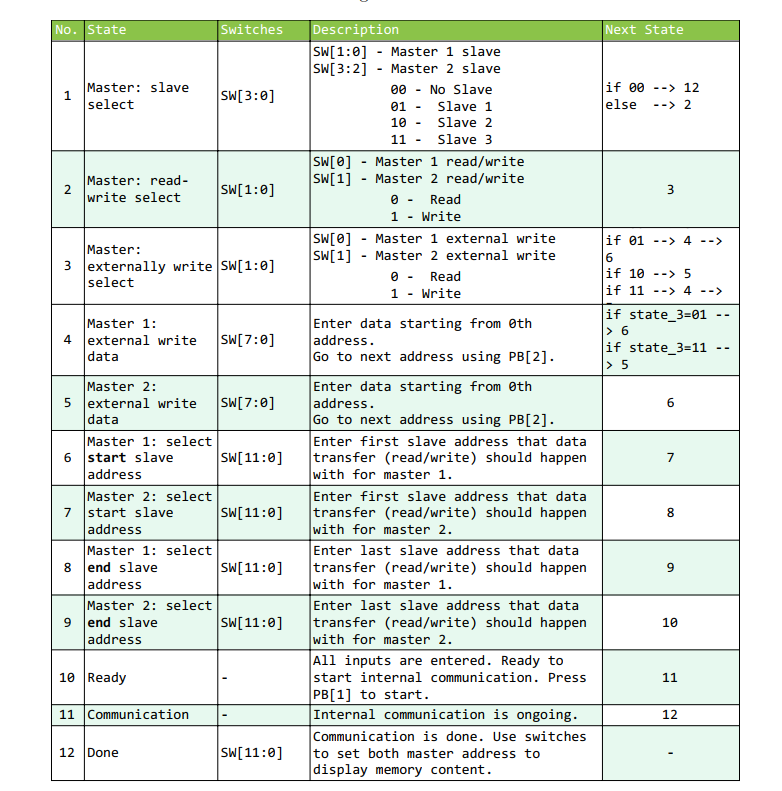
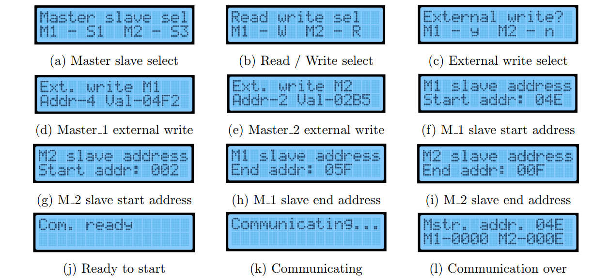

# Methodology
## Internal Comm
* First the user needs to provide the requirements to setup the communication variables. These inputs are taken using the 18 switches in the FPGA board in several consecutive
states. 
* The requirements and the given value by the user is visible on the LCD display. Push buttons are used to go to the next state in order to give the next
input. 
* The usage of the push buttons is as follows
  * PB[0] - Reset system to initial state
  * PB[1] - Go to next state
  * PB[2] - Go to next address (Used during externally write only)
  * PB[3] - Start external communication

* The user inputs can be taken in the appropriate states. The following table describes the states that the user see during internal communication testing.

* If no slaves are selected for both masters in state 1, the rest of the states will not be activated. Instead, the system directly goes to the "done" state as described in table.
*  The user can use this to display the memory content of the masters before initializing the communication. If the user does not select any data transfer that externally changes master’s memory content in state 3, states 4 & 5 may not appear accordingly.

*  Following images shows the LCD display in each of the above described states. 

---
## External Comm

* To connect a device for external communication, the ground pin should be connected to a common ground. 
* Next, the UART should be connected through General Purpose
Input Output (GPIO) pins. The GPIO pins are used as
follows.
  * Rx pins:
    * GPIO[0] - Receive data. (an 8 bit value)
    * GPIO[1] - Transmit acknowledgement for the received data. (Acknowledgement bit pattern)
  * Tx pins:
    * GPIO[2] - Receive acknowledgement for transmitted data. (Acknowledgement bit pattern)
    * GPIO[3] - Transmit data. (an 8 bit value)
  
* Connect the Rx data pin (GPIO[0]) and acknowledgement (GPIO[1]) to the Tx data pin and acknowledgement pin respectively of the external device, and vice versa.
* To initialize the external communication, first set the initial value (from 0 to 63) using SW[5:0] switches. 
* Press BP[3] button to start external communication. Then the initialized value will be displayed on the seven segment display for 5 seconds and after increment by one, the value will be sent to the next FPGA board.
* When a value from a external FPGA is received by this FPGA board, that value will be displayed on the seven segment for 5 seconds, then increment by one and sends to the other FPGA board via UART protocol.

---
## Before compile

* Set the absolute path of the "**m_mem.txt**" in [masterBram.sv](src/masterBram.sv) and "**s_slave-mem-1.txt, s_slave-mem-2.txt, s_slave-mem-1.txt**" in [slave.sv](src/slave.sv) files. 
### For simulation:
* Use `localparam MAX_CLK_COUNT = 12; //for simulation use this line` (line 13) and comment out `localparam MAX_CLK_COUNT = (CLK_FREQ / 1000 ) * TIME_DELAY  ; // for synthesis use this line` (line 12) in [top_debouncer.sv](src/top_debouncer.sv).
* Use `else if (clock_ < CLK_FREQ*CLOCK_DURATION)begin` (line 210) and comment out `else if (clock_ < 10000*CLOCK_DURATION)begin` (line 211) in [masterExternal](src/masterExternal.sv).
### For synthesis:
* Comment out `localparam MAX_CLK_COUNT = 12; //for simulation use this line` (line 13) and use `localparam MAX_CLK_COUNT = (CLK_FREQ / 1000 ) * TIME_DELAY  ; // for synthesis use this line` (line 12) in [top_debouncer.sv](src/top_debouncer.sv).
* Comment out `else if (clock_ < CLK_FREQ*CLOCK_DURATION)begin` (line 210) and use `else if (clock_ < 10000*CLOCK_DURATION)begin` (line 211) in [masterExternal](src/masterExternal.sv).
